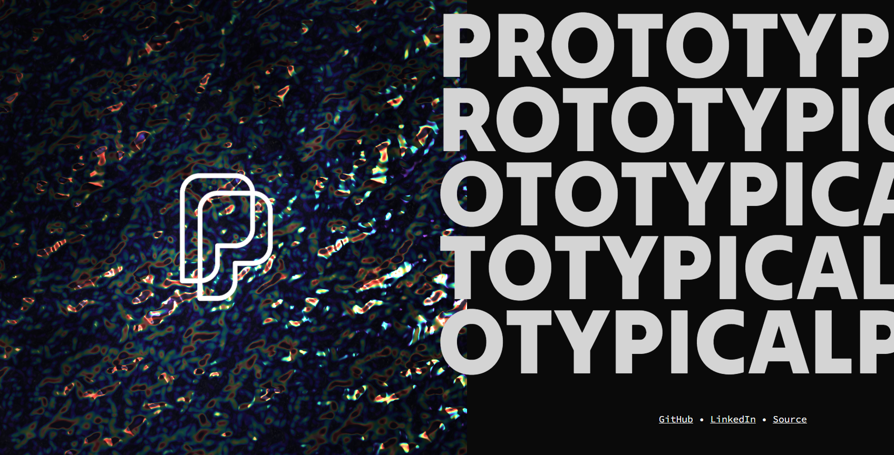
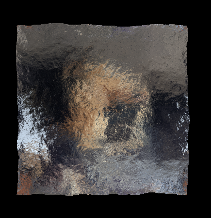
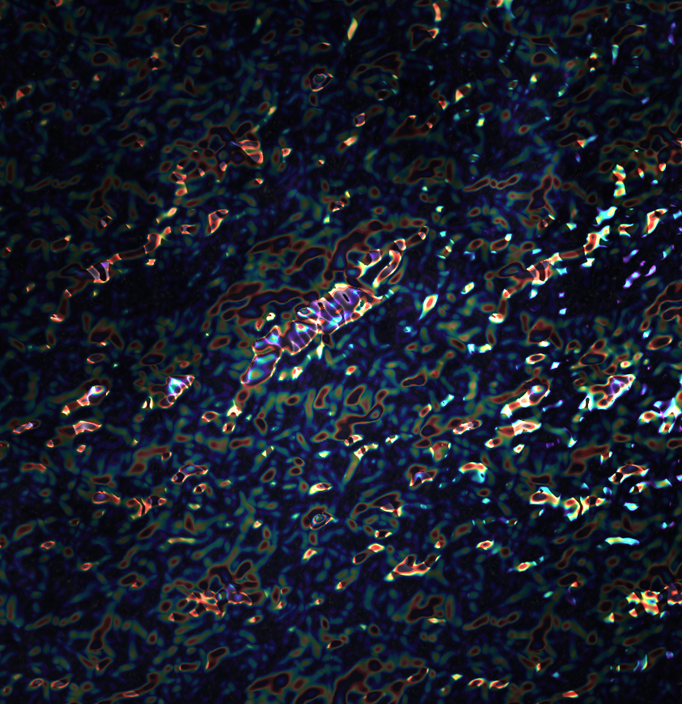

# Personal Website

A simulated ocean surface with oil-slick look. The ocean geometry is computed in Rust WASM, and all rendering is done in WebGL.

This project is the cumulation of about two years on and off. I started by implementing the ocean surface in GLSL, but that proved too slow as it required too many draw calls to do the required FFTs. As WebGPU was not available by this point, I opted to switch to WASM with SIMD for a performant 2D FFT. There were/are several FFT libraries available that work in WASM, but I ended up implementing my own to learn more about Rust and FFTs.

The ocean surface rendering is all based on [Horvath, 2015](https://dl.acm.org/doi/10.1145/2791261.2791267), which renders a model of ocean frequency spectra them computes the 2D inverse FFT to determine the surface and normals. This project uses JONSWAP + Hassleman + Capillary dispersion as recommended in the paper. To keep the FFT size down the spectrum is split into 2 frequency bins which each get a 256 point FFT (or 128 point on mobile). I used the following projects as additional references:

- [EncinoWaves](https://github.com/blackencino/EncinoWaves),
- [Nvidia WaveWorks](https://github.com/NVIDIAGameWorks/WaveWorks_Archive) archive,
- [FFT-Ocean](https://github.com/gasgiant/FFT-Ocean) for unity.

After getting the ocean surface working, I played with different methods for rendering the surface. I knew I wanted something with refraction, so I started by trying different refraction techniques until I found LEADR Mapping ([Dupuy, 2013](https://dl.acm.org/doi/10.1145/2508363.2508422)), which was recommended by other game developers for ocean surfaces. LEADR mapping is typically used for reflection, however there is plenty of literature on how to implement it with refraction ([Guo, 2016](https://dl.acm.org/doi/abs/10.1007/s00371-015-1141-8)). With LEADER mapping my ocean then looked like this:

Now that I had an ocean and some rendering, all that was left was to make it look nice. I played with several different ideas, including toon shading, hue shift, dynamic skybox, etc. What ended up catching my eye was an oil-slick style shader based on thin-film interference, shown below in the bottom left:

<video controls src="readme/wavesnew.mp4" title="4 Rendering Ideas for Waved"></video>

On it's own this shader is neat, but it shines when the input to the intensity of the oil slick is reflection _and_ refraction. The final effect is a continuously shimmering ocean surface which occasionally allows the background photo of the milky way to shine through.

